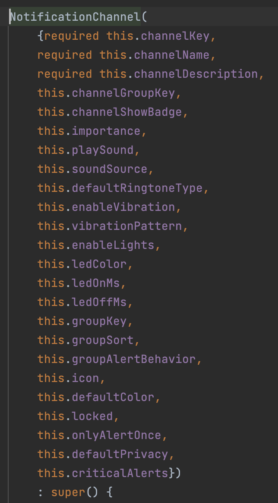
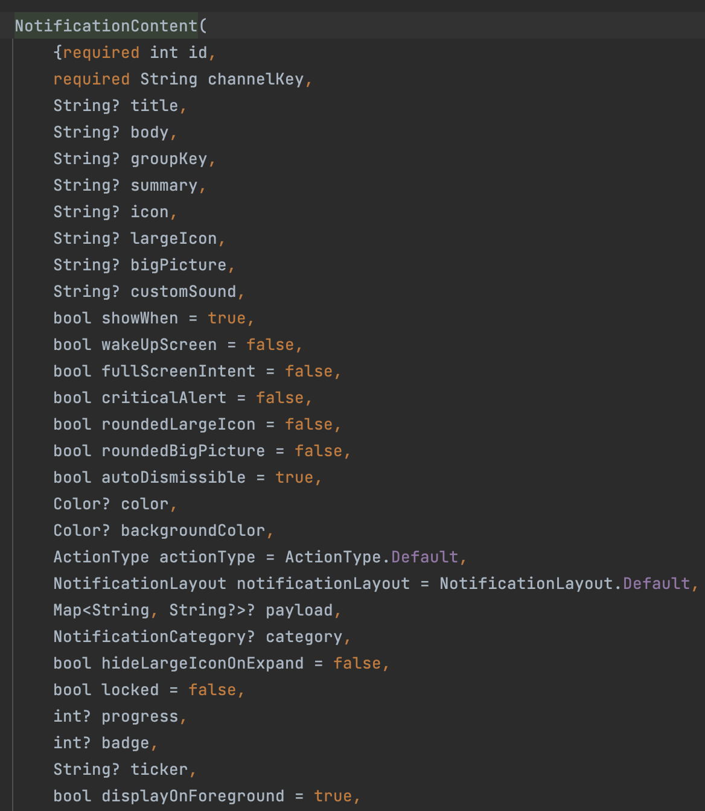
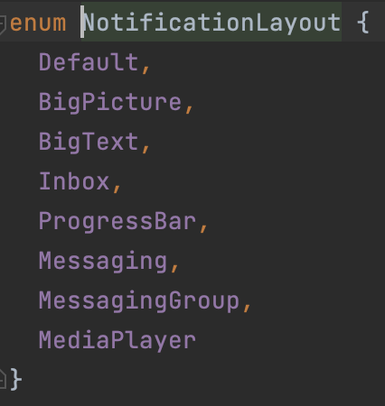

# awesome_notifications_package_flutter

A new Flutter project.

## Getting Started

This project is a starting point for a Flutter application.

A few resources to get you started if this is your first Flutter project:

- [Lab: Write your first Flutter app](https://docs.flutter.dev/get-started/codelab)
- [Cookbook: Useful Flutter samples](https://docs.flutter.dev/cookbook)

For help getting started with Flutter development, view the
[online documentation](https://docs.flutter.dev/), which offers tutorials,
samples, guidance on mobile development, and a full API reference.

## 1. Research: Awesome Notifications Package Flutter

- Keywords:
    - awesome notifications flutter package
    - awesome notifications flutter example
    - awesome notification fcm flutter
    - awesome_notifications fcm
    - awesome_notifications fcm example
    - awesome notifications
    - flutter awesome notifications background
    - flutter_local_notifications vs awesome_notifications
    - flutter local notifications with firebase messaging
    - awesome_notifications flutter
    - flutter notification example
    - push notification in flutter
    - awesome notification fcm
    - flutter push notifications
- Video Title: Awesome Notifications Flutter Package | Flutter Local/Push Notifications with
  Background Example

## 2. Research: Competitors

**Flutter Videos/Articles**

- 9.4K: https://www.youtube.com/watch?v=peHu9yWKUvI
- 7K: https://www.youtube.com/watch?v=-W2LDnWKhag
- 2.1K: https://www.youtube.com/watch?v=uZvWY1VGnZU
- 1.8K: https://www.youtube.com/watch?v=GRurbrfLanE
- 11K: https://www.youtube.com/watch?v=fMoQTHUvy5s
- 66K: https://www.youtube.com/watch?v=JAq9fVn3X7U
- 3K: https://www.youtube.com/watch?v=3hZLhR37hps
- 1.5K: https://www.youtube.com/watch?v=rFgp7qNGxPU
- 3.2K: https://www.youtube.com/watch?v=q1PdL4I_WU4
- https://pub.dev/packages/awesome_notifications
- https://resocoder.com/2021/08/13/flutter-awesome-notifications-create-local-notifications-with-ease/
- https://www.fluttercampus.com/guide/246/push-local-notification-firebase-fcm/
- https://morioh.com/p/08596993f876
- https://morioh.com/p/27b0b4d35f1e
- https://medium.com/@raghavthegreat1/local-notifications-in-flutter-using-awesome-notifications-part-1-bedc20e27e63

**Android/Swift/React Videos**

- 33K: https://youtu.be/c0bkqJdf4YU
- 44K: https://youtu.be/M5RuFo-85cY
- 14K: https://youtu.be/Cxc4J3AHTDY
- 9.3K: https://youtu.be/GDxj8KTmLrI
- 55K: https://youtu.be/m8vUFO5mFIM
- 65K: https://youtu.be/2xoJi-ZHmNI
- 17K: https://youtu.be/C_qdD6tFo28
- 69K: https://youtu.be/UJree24HWx0
- 35K: https://youtu.be/nCbVvzqLRJQ
- 51K: https://youtu.be/vvq0etotS8M
- 17K: https://youtu.be/cZbEGJOPZ98
- 48K: https://youtu.be/Qcxa6dxfUFo
- 29K: https://youtu.be/zuQ3Qo--TUo
- 108K: https://youtu.be/z6DEJXYQpP4
- https://www.tutorialspoint.com/android/android_push_notification.htm
- https://developer.android.com/develop/ui/views/notifications/build-notification
- https://www.geeksforgeeks.org/how-to-push-notification-in-android/
- https://onesignal.com/blog/how-to-add-push-notifications-to-an-android-app-with-java-and-kotlin/
- https://www.javatpoint.com/android-notification
- https://www.twilio.com/docs/chat/android/push-notifications
- https://www.pubnub.com/tutorials/push-notifications-android-kotlin/
- https://developer.android.com/codelabs/advanced-android-kotlin-training-notifications-fcm
- https://onesignal.com/blog/how-to-add-push-notifications-into-an-ios-app/
- https://www.swiftlyrush.com/push-notifications-in-ios/
- https://www.kodeco.com/11395893-push-notifications-tutorial-getting-started
- https://www.appcoda.com/push-notification-ios/
- https://developer.apple.com/documentation/usernotifications
- https://levelup.gitconnected.com/custom-push-notification-in-ios-swift-5-210552643e86
- https://www.javatpoint.com/push-notifications-in-ios
- https://www.airship.com/resources/explainer/ios-push-notifications-explained/
- https://blog.logrocket.com/create-send-push-notifications-react-native
- https://www.npmjs.com/package/react-native-push-notification
- https://developers.connectycube.com/reactnative/push-notifications
- https://sendbird.com/developer/tutorials/implement-react-native-app-push-notifications
- https://reactnative.dev/docs/pushnotificationios
- https://rnfirebase.io/messaging/notifications
- https://enappd.com/blog/firebase-push-notifications-in-react-native/81/
- https://medium.com/nerd-for-tech/react-native-local-push-notifications-4dcca5a14fd4

**Great Features**

- This plugin can create Local and Push Notifications, customizing buttons, images, sounds,
  emoticons and applying many different layouts for Flutter apps.
- Find more features
  at [pub.dev/packages/awesome_notifications](https://pub.dev/packages/awesome_notifications).

**Problems from Videos**

- Question: How to send that push notification from my php server to a specific user only?

Answer: There is firebase message plugin for php, use that to send notification, and you need device
fcm token to send notification to specific device.

- Question: How to send every 30 sec HTTP post URL even then flutter app minimize or terminated?
  App sending data but it stops when close or minimize.

Answer: Creating a background task will do the job. There is a package for this work manager.

- Question: How can i set a duration on date , so that it notifies me on my birthday

Answer: You can try to take the difference between DateTime now with your birthday in seconds and
add it to the duration.

- Question: I create static onActionReceived() method and call it in setListeners for receiving
  payload. But when I hot reload my app it say Invalid global or static function to receive
  notification on background.

- Question: The method 'setListeners' isn't defined for the type 'AwesomeNotifications'.
  Try correcting the name to the name of an existing method, or defining a method named '
  setListeners'.

- Question: Can it possible that notification get pop out rather than to scroll it to view?

Answer: Set `importance: NotificationImportance.Max,` of initialization of NotificationChannel.

- Question: How to create progress bar notification?

Answer: Set `notificationLayout: NotificationLayout.ProgressBar,` of showNotification.

**Problems from Flutter Stackoverflow**

- https://stackoverflow.com/questions/74942322/awesome-notifications-v0-7-3-on-flutter-fails-to-build
- https://stackoverflow.com/questions/73982330/awesome-notification-v0-7-1-fails-to-build
- https://stackoverflow.com/questions/73982648/awesome-notifications-invalid-notification-i-am-using-awesome-notification-pack
- https://stackoverflow.com/questions/75375751/flutter-awesome-notifications-how-to-fix-stateerror-bad-state-stream-has-alrea
- https://stackoverflow.com/questions/64499092/issue-in-displaying-notification-with-awesome-notifications-in-flutter
- https://stackoverflow.com/questions/71002488/awesome-notification-flutter-i-cannot-receive-notfication-when-app-terminated-w
- https://stackoverflow.com/questions/76113406/how-to-make-awsome-notification-notification-can-be-push-to-another-page-off
- https://stackoverflow.com/questions/74262936/awesome-notifications-9522-invalid-notification-no-valid-small-icon

## 3. Video Structure

**Main Points / Purpose Of Lesson**

1. Run `dart pub  add awesome_notifications` to add awesome_notifications package in your project's
   pubspec.yaml file.
2. Main points:
    - Normal and Simple Notification
    - Notification with Summary
    - Progress Bar Notification
    - Message Notification
    - Big Image Notification
    - Action Button Notification
    - Scheduled Notification
3. You can also enable critical alerts or precise alarm/schedule by giving some permissions in
   AndroidManifest.xml file.

**The Structured Main Content**

1. Run `dart pub add awesome_notifications` to add awesome_notifications package in your project's
   pubspec.yaml file.
2. Output of this project is following:
   
3. Read [this](https://pub.dev/packages/awesome_notifications#-schedule-precision)
   and [this](https://pub.dev/packages/awesome_notifications#-important-notes).

   So, add following in android >app >src >main > AndroidManifest.xml to show scheduled
   notifications or critical notifications.

    ```xml 
    <uses-permission android:name="android.permission.SCHEDULE_EXACT_ALARM" />
    <uses-permission android:name="android.permission.ACCESS_NOTIFICATION_POLICY" />
    ```

4. First of all, you have to initialize notifications service
   using `await AwesomeNotifications().initialize()` in `notification_service.dart` and call this
   initialization in runApp of `main.dart` file.
5. `notification_service.dart` contains `NotificationService` class and this class contains
   `initializeNotification()` and `showNotification()` methods.
    - First, it initialize notifications using `await AwesomeNotifications().initialize()`.

      Initializes the plugin, creating a default icon and the initial channels. Only needs to be
      called at `main.dart`.

      Initialize has following properties:
        - `defaultIcon`, set the icon to null if you want to use the default app icon
        - `channels`, it is list of `NotificationChannel()`.
          It has following properties:
          

          channelKey, channelName, and channelDescription are required properties.

          Set `importance: NotificationImportance.Max,` to show notifications as popup.
        - `channelGroups`, it is list of `NotificationChannelGroup()`. It has two properties.

          channelGroupKey, and channelGroupName both are required parameters.
    - Now request to send notifications:

```dart     
      await AwesomeNotifications().isNotificationAllowed().then(
      (isAllowed) async {
        if (!isAllowed) {
          await AwesomeNotifications().requestPermissionToSendNotifications();
        }
      },
   );
```

- Set listeners to track notifications using `awesomeNotification().setListeners()`
    - onActionReceivedMethod method that receives all the notification actions
    - onNotificationCreatedMethod method that gets called when a new notification or schedule is
      created on the system
    - onNotificationDisplayedMethod method that gets called when a new notification is displayed
      on status bar
    - onDismissActionReceivedMethod method that receives the notification dismiss actions
    - All other methods print their relevant actions in console.
    - onActionReceivedMethod method is used to go to another page when notification shows and user
      clicks on button. User `navigatorKey` defined in MyApp to go other pages by clicking on
      notification buttons.

```dart 
  static Future<void> onActionReceivedMethod(
      ReceivedAction receivedAction) async {
    debugPrint('onActionReceivedMethod');
    final payload = receivedAction.payload ?? {};
    if (payload['navigate'] == 'true') {
      MyApp.navigatorKey.currentState?.push(
        MaterialPageRoute(
          builder: (_) => const SecondScreen(),
        ),
      );
    }
  }
```

- `showNotification()` method uses `await AwesomeNotifications().createNotification()` to create a
  notification. createNotification has following properties:
    - `content` is required property and accepts `NotificationContent`.

      Properties of `NotificationContent` are following:
      

      id and channelKey are required parameters. I have set id to -1. It means, we have no concern
      with it. It can be of any number. Notification layout may be of:
      
    - `schedule` accepts `NotificationInterval`. interval is required parameter of
      NotificationInterval.

      If you want to schedule notification,
      use `assert(!scheduled || (scheduled && interval != null));`
      in start of showNotification() method. Also use `SCHEDULE_EXACT_ALARM` in androidmanifest
      file.

    - actionButtons accepts list of NotificationActionButton to go to any other screen of the app by
      clicking on notification button.

- Call `initializeNotification()` in `main.dart` and call `showNotification()` method in HomeScreen
  to show notifications in HomeScreen.

  Complete code of NotificationClass is following:

```dart
class NotificationService {
  static Future<void> initializeNotification() async {
    await AwesomeNotifications().initialize(
      // set the icon to null if you want to use the default app icon
      null,
      [
        NotificationChannel(
          channelGroupKey: 'basic_notification_channel',
          channelKey: 'basic_notification_channel',
          channelName: 'Basic notifications',
          channelDescription: 'Notification channel for basic tests',
          defaultColor: const Color(0xFF9D50DD),
          ledColor: Colors.white,
          importance: NotificationImportance.Max,
          channelShowBadge: true,
          onlyAlertOnce: true,
          playSound: true,
          criticalAlerts: true,
        )
      ],
      channelGroups: [
        NotificationChannelGroup(
          channelGroupKey: 'basic_notification_channel_group',
          channelGroupName: 'Group 1',
        )
      ],
      debug: true,
    );

    await AwesomeNotifications().isNotificationAllowed().then(
          (isAllowed) async {
        if (!isAllowed) {
          await AwesomeNotifications().requestPermissionToSendNotifications();
        }
      },
    );

    await AwesomeNotifications().setListeners(
      onActionReceivedMethod: onActionReceivedMethod,
      onNotificationCreatedMethod: onNotificationCreatedMethod,
      onNotificationDisplayedMethod: onNotificationDisplayedMethod,
      onDismissActionReceivedMethod: onDismissActionReceivedMethod,
    );
  }

  /// Use this method to detect when a new notification or a schedule is created
  static Future<void> onNotificationCreatedMethod(_) async =>
      debugPrint('onNotificationCreatedMethod');

  /// Use this method to detect every time that a new notification is displayed
  static Future<void> onNotificationDisplayedMethod(_) async =>
      debugPrint('onNotificationDisplayedMethod');

  /// Use this method to detect if the user dismissed a notification
  static Future<void> onDismissActionReceivedMethod(_) async =>
      debugPrint('onDismissActionReceivedMethod');

  /// Use this method to detect when the user taps on a notification or action button
  static Future<void> onActionReceivedMethod(ReceivedAction receivedAction) async {
    debugPrint('onActionReceivedMethod');
    final payload = receivedAction.payload ?? {};
    if (payload['navigate'] == 'true') {
      MyApp.navigatorKey.currentState?.push(
        MaterialPageRoute(
          builder: (_) => const SecondScreen(),
        ),
      );
    }
  }

  static Future<void> showNotification({
    required final String title,
    required final String body,
    final String? summary,
    final Map<String, String>? payload,
    final actionType = ActionType.Default,
    final notificationLayout = NotificationLayout.Default,
    final NotificationCategory? category,
    final String? bigPicture,
    final List<NotificationActionButton>? actionButtons,
    final bool scheduled = false,
    final int? interval,
  }) async {
    assert(!scheduled || (scheduled && interval != null));

    await AwesomeNotifications().createNotification(
      content: NotificationContent(
        id: -1,
        channelKey: 'basic_notification_channel',
        title: title,
        body: body,
        actionType: actionType,
        notificationLayout: notificationLayout,
        summary: summary,
        category: category,
        payload: payload,
        bigPicture: bigPicture,
      ),
      actionButtons: actionButtons,
      schedule: scheduled
          ? NotificationInterval(
        interval: interval,
        timeZone:
        await AwesomeNotifications().getLocalTimeZoneIdentifier(),
        preciseAlarm: true,
      )
          : null,
    );
  }
}
```

6. `home_screen.dart` file contains HomeScreen of project. It contains seven custom
   NotificationButton from widgets folder in column.

- Simple notification button:

```dart        
       NotificationButton(
              text: 'Normal Notification',
              onPressed: () async => await NotificationService.showNotification(
                title: 'Title of the notification',
                body: 'Body of the notification',
              ),
            ),
```

- Notification with summary button:

```dart 
            NotificationButton(
              text: 'Notification With Summary',
              onPressed: () async => await NotificationService.showNotification(
                title: 'Title of the notification',
                body: 'Body of the notification',
                summary: 'Small Summary',
                notificationLayout: NotificationLayout.Inbox,
              ),
            ),
```

- Big Image Notification button:

```dart 
            NotificationButton(
              text: 'Big Image Notification',
              onPressed: () async => await NotificationService.showNotification(
                title: 'Title of the notification',
                body: 'Body of the notification',
                summary: 'Small Summary',
                notificationLayout: NotificationLayout.BigPicture,
                bigPicture:
                    'https://files.tecnoblog.net/wp-content/uploads/2019/09/emoji.jpg',
              ),
            ),
```

- Action Button Notification:

By clicking on `Check it out` button, it will check payload and then go to NotificationScreen.

```dart 
            NotificationButton(
              text: 'Action Buttons Notification',
              onPressed: () async => await NotificationService.showNotification(
                title: 'Title of the notification',
                body: 'Body of the notification',
                payload: {'navigate': 'true'},
                actionButtons: [
                  NotificationActionButton(
                    key: 'check',
                    label: 'Check it out',
                    actionType: ActionType.SilentAction,
                    color: Colors.green,
                  ),
                ],
              ),
            ),
```

- Scheduled Notification Button:

```dart 
            NotificationButton(
              text: 'Scheduled Notification',
              onPressed: () async => await NotificationService.showNotification(
                title: 'Scheduled Notification',
                body: 'Notification was fired after 5 seconds',
                scheduled: true,
                interval: 5,
              ),
            ),
```